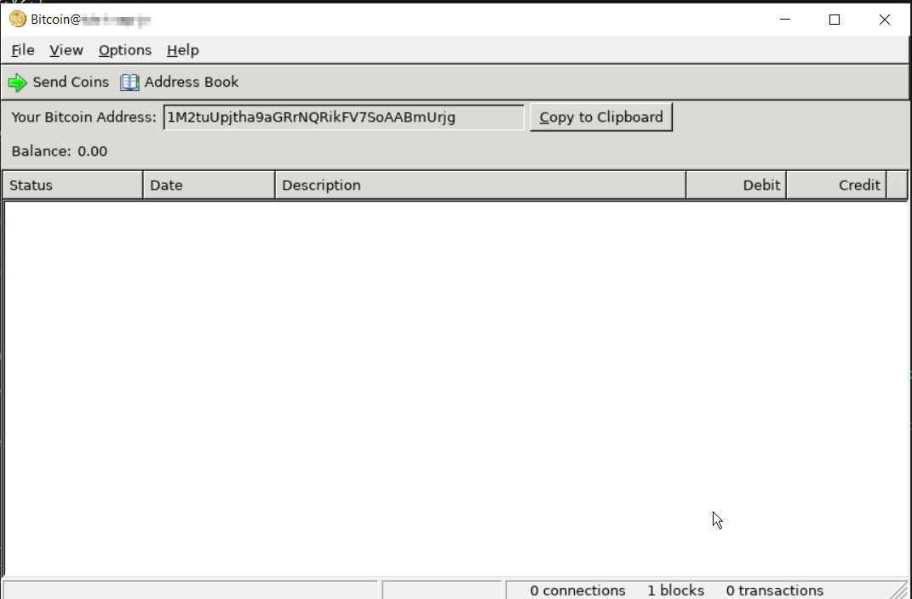
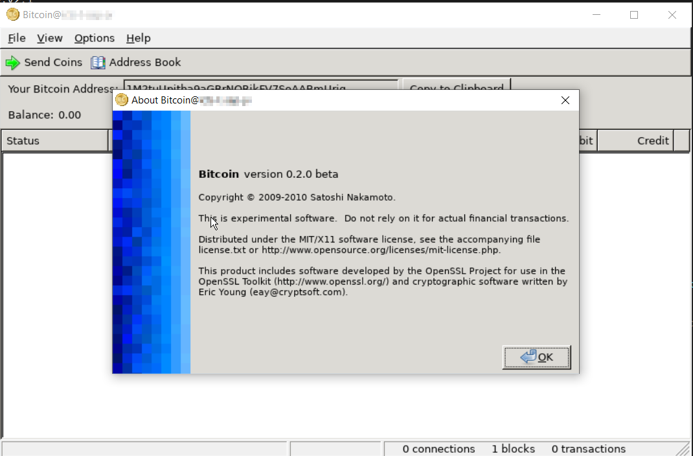
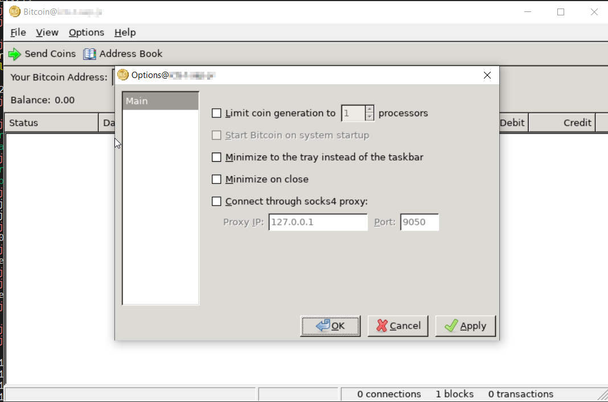

# Bitcoin Core v0.2.1

[](https://github.com/mocacinno/bitcoin_core_docker/actions/workflows/build-and-publish.yml)<br>
<br>
<br>

- **Version:** v0.2.1
- **Tag:** v0.2.1
- **Release Date:** 2010-06-30
- **Docker Pull Command**:
  - `docker pull ghcr.io/mocacinno/mocacinno/bitcoin_core_docker:v2.1`
  - `docker pull mocacinno/btc_core:v2.1`
- **Compiled by**: Mocacinno
- **Changelog**: [View Sourcecode](https://github.com/mocacinno/bitcoin_core_history/blob/v0.2.1/changelog.txt)

## comments about the image

- used a manually compiled boost 1.57.0 instead of the system's boost version
- built berkeley db 4.7.25 NC from source
- built openssl 0.9.8k from source
- built util macros 1.3.0 from source
- built libXtrans 1.0.2 from source
- built pango 1.24.5 from source, had to pull in freetype1 aswell
- built wxwidgets 2.9.0 from source
- used gcc4.8
- loads and loads of linked library's

### style break

versions v0.2.0 till v0.2.6 are completely different from the other versions (and images).
It seems like these very old versions don't have a headless daemon... You HAVE to run a gui... Which is great fun inside a docker container (sarcasm).  
Because this requirement, i was no longer able to package this version inside a neat, safe, small minimal container, but i had to use a much larger base image instead (so, it has more attack vectors and a bigger size). 

What i did to get this stuff running:

```bash
#on my docker host (not inside the container)
xauth list
#i then copied all the magic cookies... each line contains one magic cookie, corresponding to one screen!!!
#i then started my container
docker run -e DISPLAY=$DISPLAY -v /tmp/.X11-unix:/tmp/.X11-unix --network=host --entrypoint /bin/bash -it mocacinno/btc_core:v2.1
#inside my container, i tried each magic cookie combined with each screen... So for example this was one of my tries:
export DISPLAY=localhost:10.0
xauth add myhostname/unix:10 MIT-MAGIC-COOKIE-1 randomstring_copied_from_first_step
bitcoin
#then i tried the second magic cookie
export DISPLAY=localhost:11.0
xauth add myhostname/unix:11 MIT-MAGIC-COOKIE-1 randomstring_copied_from_first_step
bitcoin
```

### movie time


<link rel="stylesheet" href="https://mocacinno.com/asciinema-player.css">
   <div id="fullnode"></div>
   <script src="https://mocacinno.com/asciinema-player.min.js"></script>
   <script>
      AsciinemaPlayer.create('./casts/v0.2.1.cast', document.getElementById('fullnode'));
   </script>


### screenshots

And, because asciinema does not show images, here's what poppep up on my screen:

#### main screen



#### about

Old core versions were a bit wonky when it came to versioning. In the old archives, clear tags aren't always available, so it isn't always clear at which commit the version was increased (nor was the version number updated clearly). What i call "version v0.2.1" is probably somewhere in between v0.2.0 and v0.2.1 (eventough it's probably much closer to what satoshi considered v0.2.1). In this case "my" v0.2.1 still shows version number v0.2.0 in the about screen, but rest assured, this version was either v0.2.1, or v0.2.1 was *almost* identical to this one!



#### options



## extra info

**This is NOT a multistage build** due to the fact the gui needs much more than a minimal base image


## navigation

[Previous version: v0.2.0](./v2.0.md) | [Next version: v0.2.2](./v2.2.md)

[Back to the overview](./)

[Back to the main menu](../)

For more information on how to use the Docker image, visit the [User Documentation](../userdocs/).
