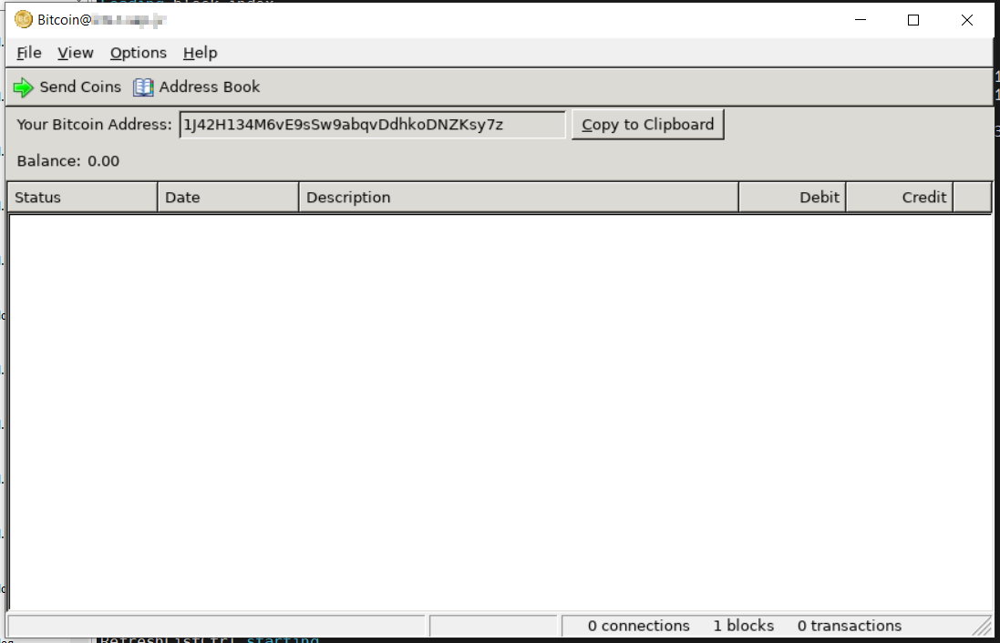
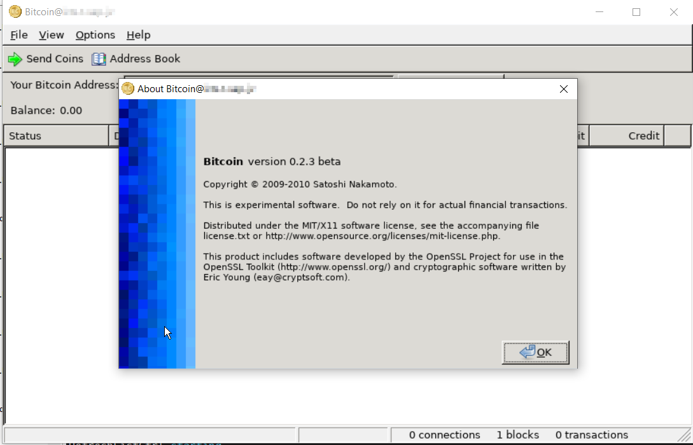

# Bitcoin Core v0.2.3

[](https://github.com/mocacinno/bitcoin_core_docker/actions/workflows/build-and-publish.yml)  
  
  

- **Version:** v0.2.3
- **Tag:** v0.2.3
- **Release Date:** 2010-08-12
- **Docker Pull Command**:
  - `docker pull ghcr.io/mocacinno/mocacinno/bitcoin_core_docker:v2.3`
  - `docker pull mocacinno/btc_core:v2.3`
- **Compiled by**: Mocacinno
- **Changelog**: [View Sourcecode](https://github.com/bitcoin/bitcoin/tree/v0.2.3)

## comments about the image

- used a manually compiled boost 1.57.0 instead of the system's boost version
- built berkeley db 4.7.25 NC from source
- built openssl 0.9.8k from source
- built util macros 1.3.0 from source
- built libXtrans 1.0.2 from source
- built pango 1.24.5 from source, had to pull in freetype1 aswell
- built wxwidgets 2.9.0 from source
- used gcc4.8
- loads and loads of linked library's

### style break

versions v0.2.0 till v0.2.6 are completely different from the other versions (and images).
It seems like these very old versions don't have a headless daemon... You HAVE to run a gui... Which is great fun inside a docker container (sarcasm).  
Because this requirement, i was no longer able to package this version inside a neat, safe, small minimal container, but i had to use a much larger base image instead (so, it has more attack vectors and a bigger size). Because i'm jumping from windows to linux, the wxwidgets gui looks like crap on my pc... I really hope you guys have more luck than i did!!!

What i did to get this stuff running:

```bash
#on my docker host (not inside the container)
xauth list
#i then copied all the magic cookies... each line contains one magic cookie, corresponding to one screen!!!
#i then started my container
docker run -e DISPLAY=$DISPLAY -v /tmp/.X11-unix:/tmp/.X11-unix --network=host --entrypoint /bin/bash -it mocacinno/btc_core:v2.3
#inside my container, i tried each magic cookie combined with each screen... So for example this was one of my tries:
export DISPLAY=localhost:10.0
xauth add myhostname/unix:10 MIT-MAGIC-COOKIE-1 randomstring_copied_from_first_step
bitcoin
#then i tried the second magic cookie
export DISPLAY=localhost:11.0
xauth add myhostname/unix:11 MIT-MAGIC-COOKIE-1 randomstring_copied_from_first_step
bitcoin
```

### movie time


<link rel="stylesheet" href="https://mocacinno.com/asciinema-player.css">
   <div id="fullnode"></div>
   <script src="https://mocacinno.com/asciinema-player.min.js"></script>
   <script>
      AsciinemaPlayer.create('./casts/v0.2.3.cast', document.getElementById('fullnode'));
   </script>


### screenshots

And, because asciinema does not show images, here's what poppep up on my screen:

#### main screen



#### about



#### options


## extra info

**This is NOT a multistage build** due to the fact the gui needs much more than a minimal base image

## navigation

[Previous version: v0.2.2](./v2.2.md) | [Next version: v0.2.4](./v2.4.md)

[Back to the overview](./)

[Back to the main menu](../)

For more information on how to use the Docker image, visit the [User Documentation](../userdocs/).
